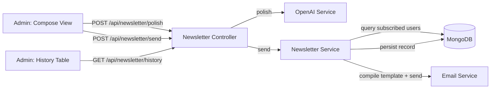

# Design Document: Newsletter Broadcast

## Overview

The Newsletter Broadcast feature adds an end-to-end admin workflow for composing, AI-refining, and dispatching branded email broadcasts to all subscribed platform users. It spans the full stack:

- A new `Newsletter` Mongoose model for history persistence
- A `newsletterSubscribed` boolean on the existing `User` schema
- Three new backend endpoints under `/api/newsletter/` (polish, send, history)
- A new `newsletter` backend module following the existing route → controller → service → schema pattern
- Two new frontend views inside the Super Admin dashboard: a Compose form and a History table
- A new Handlebars email template (`newsletter-broadcast.hbs`) that reuses existing partials

The feature reuses the existing `emailService.js` (Nodemailer + Handlebars), `openaiService.js` (OpenAI SDK), auth middleware (`protect`, `restrictTo`), `asyncHandler`, `AppError`, and `apiResponse` helpers. No new infrastructure or third-party dependencies are required.



## Architecture

The feature follows the established module pattern: `backend/src/modules/newsletter/` with four files.

### Backend Flow

1. **Polish flow**: `POST /api/newsletter/polish` → `newsletter.controller.js` validates `draft` → calls `openaiService.polishNewsletter(draft)` → returns `{ polishedText }`.
2. **Send flow**: `POST /api/newsletter/send` → controller validates `subject` + `body` → responds HTTP 202 immediately → `newsletter.service.js` queries subscribed+active users → compiles `newsletter-broadcast.hbs` via `emailService.compileTemplate` → dispatches in batches with `Promise.allSettled` → persists a `Newsletter` document.
3. **History flow**: `GET /api/newsletter/history` → controller calls service → returns all newsletters sorted by `sentAt` desc with populated sender info.

### Frontend Flow

Two new pages under `frontend/src/pages/super-admin/`:
- `Newsletter.tsx` — the main page containing both the Compose form and the History table as sections/tabs.

Both views live behind the existing `SuperAdminGuard` and use `SuperAdminLayout`.

### Route Registration

- Backend: `app.js` mounts `newsletterRoutes` at `/api/newsletter` with `requireEmailVerified` middleware.
- Frontend: A new route `/super-admin/newsletter` is added to the router, wrapped in `SuperAdminGuard`. A "Newsletter" nav item is added to the `SuperAdminLayout` sidebar under the "Management" group.

## Components and Interfaces

### Backend

#### newsletter.route.js

```
POST   /api/newsletter/polish   → protect, restrictTo('admin','super_admin'), controller.polish
POST   /api/newsletter/send     → protect, restrictTo('admin','super_admin'), controller.send
GET    /api/newsletter/history   → protect, restrictTo('admin','super_admin'), controller.history
```

#### newsletter.controller.js

| Handler   | Input                        | Output                                    |
|-----------|------------------------------|-------------------------------------------|
| `polish`  | `{ draft: string }`          | 200 `{ success, data: { polishedText } }` |
| `send`    | `{ subject: string, body: string }` | 202 `{ success, message }` |
| `history` | —                            | 200 `{ success, data: Newsletter[] }`     |

All handlers use `asyncHandler` and `success()`/`error()` response helpers.

#### newsletter.service.js

| Method                | Responsibility                                                                 |
|-----------------------|--------------------------------------------------------------------------------|
| `polishDraft(draft)`  | Calls `openaiService.polishNewsletter(draft)`, returns polished text string    |
| `sendNewsletter(subject, body, adminId)` | Queries subscribed users, dispatches batch emails, persists Newsletter doc |
| `getHistory()`        | Returns all Newsletter docs sorted by `sentAt` desc, populates `sentBy`       |

#### openaiService.js (extension)

A new method `polishNewsletter(draft)` is added to the existing `OpenAIService` class:
- System prompt: "You are a professional copywriter for Trustificate. Rewrite the following draft in a calm, institutional, and trustworthy tone. Return only the rewritten text, no commentary."
- Model: `gpt-3.5-turbo`, temperature: 0.7, max_tokens: 1024
- Returns the content string from `choices[0].message.content`
- Throws `Error('OpenAI API key not configured')` if no key, or `Error('Failed to polish newsletter draft')` on API failure

#### emailService.js (no changes)

The existing `compileTemplate` function is used directly. No modifications needed.

#### newsletter-broadcast.hbs (new template)

A new Handlebars template that reuses `{{> email-header}}` and `{{> promotional-footer}}` partials. It accepts:
- `subject` — rendered as the `<h1>` heading
- `body` — rendered as paragraph text inside the branded white card
- `unsubscribeLink` — passed through to the `promotional-footer` partial

This template is simpler than `feature-announcement.hbs` — no CTA button, no recipient name greeting. Just subject + body + branding.

### Frontend

#### Newsletter.tsx (page)

The main super-admin page at `/super-admin/newsletter`. Contains two sections:
1. **Compose section** — form with subject input, body textarea, AI Polish button, and Send button
2. **History section** — table of past newsletters

Uses `SuperAdminLayout` wrapper with title "Newsletter".

#### Compose Form

- `react-hook-form` with a `zod` schema: `{ subject: z.string().min(1), body: z.string().min(1) }`
- "AI Polish" button calls `POST /api/newsletter/polish` via `apiClient`, replaces body textarea value on success
- "Send Newsletter" button calls `POST /api/newsletter/send` via `apiClient`
- On 202 response: success toast, form reset, React Query cache invalidation for `["newsletter-history"]`
- Loading states on both buttons, disabled during in-flight requests

#### History Table

- Fetches from `GET /api/newsletter/history` using `useQuery({ queryKey: ["newsletter-history"] })`
- Columns: Subject, Body Preview (truncated to ~80 chars), Sender (displayName), Date (formatted), Recipients
- Loading skeleton while fetching
- Error state with retry button

#### API Functions

A small `lib/newsletter.ts` or inline calls using `apiClient`:

```typescript
// Polish
apiClient<{ polishedText: string }>('/api/newsletter/polish', {
  method: 'POST',
  body: JSON.stringify({ draft }),
})

// Send
apiClient('/api/newsletter/send', {
  method: 'POST',
  body: JSON.stringify({ subject, body }),
})

// History
apiClient<Newsletter[]>('/api/newsletter/history')
```

## Data Models

### Newsletter Schema (new)

```javascript
const newsletterSchema = new mongoose.Schema({
  subject:        { type: String, required: true, trim: true },
  body:           { type: String, required: true },
  sentBy:         { type: mongoose.Schema.Types.ObjectId, ref: 'User', required: true },
  sentAt:         { type: Date, default: Date.now },
  recipientCount: { type: Number, required: true },
}, { timestamps: true });
```

Collection name: `newsletters`

### User Schema (modification)

Add one field to the existing `userSchema`:

```javascript
newsletterSubscribed: { type: Boolean, default: true }
```

This field defaults to `true` (opt-in by default). No index needed — the subscription query runs infrequently (only on newsletter send) and filters on `{ newsletterSubscribed: true, isActive: true }`.

### TypeScript Types (frontend)

```typescript
interface Newsletter {
  _id: string;
  subject: string;
  body: string;
  sentBy: { _id: string; displayName: string; email: string };
  sentAt: string;
  recipientCount: number;
}
```


## Correctness Properties

*A property is a characteristic or behavior that should hold true across all valid executions of a system — essentially, a formal statement about what the system should do. Properties serve as the bridge between human-readable specifications and machine-verifiable correctness guarantees.*

### Property 1: Default subscription opt-in

*For any* newly created User document where `newsletterSubscribed` is not explicitly set, the persisted value of `newsletterSubscribed` shall be `true`.

**Validates: Requirements 1.1, 1.2**

### Property 2: Recipient filtering excludes unsubscribed and inactive users

*For any* set of User documents with varying `newsletterSubscribed` and `isActive` values, the recipient list produced by the Newsletter_Service for a send operation shall contain only users where both `newsletterSubscribed` is `true` and `isActive` is `true`.

**Validates: Requirements 1.3, 4.2**

### Property 3: Newsletter schema rejects invalid documents

*For any* Newsletter document where `subject` is empty/missing or `body` is empty/missing, Mongoose validation shall reject the document. Conversely, for any document with non-empty `subject`, non-empty `body`, a valid `sentBy` ObjectId, and a positive `recipientCount`, validation shall pass.

**Validates: Requirements 2.1, 2.3**

### Property 4: Newsletter persistence round-trip after send

*For any* valid subject, body, and admin user ID, after `sendNewsletter` completes, a Newsletter document shall exist in the database with matching `subject`, `body`, `sentBy` equal to the admin's ID, and `recipientCount` equal to the number of subscribed+active users at the time of send.

**Validates: Requirements 2.2, 4.5**

### Property 5: Admin-only endpoint access

*For any* user whose role is not `admin` or `super_admin`, requests to `POST /api/newsletter/polish`, `POST /api/newsletter/send`, and `GET /api/newsletter/history` shall return HTTP 403.

**Validates: Requirements 3.1, 4.1, 5.1**

### Property 6: Polish endpoint returns refined text for valid drafts

*For any* non-empty draft string sent to `POST /api/newsletter/polish` by an authorized admin, the response shall have HTTP 200 and contain a non-empty `polishedText` string in the response body.

**Validates: Requirements 3.2, 3.3**

### Property 7: Input validation rejects empty fields

*For any* request to `POST /api/newsletter/polish` with an empty or missing `draft`, or to `POST /api/newsletter/send` with an empty or missing `subject` or `body`, the endpoint shall return HTTP 400 with a validation error message.

**Validates: Requirements 3.4, 4.6**

### Property 8: Batch dispatch resilience

*For any* batch of recipient email addresses where a subset of sends fail, `Promise.allSettled` shall allow the remaining sends to complete successfully. The total number of attempted sends shall equal the total recipient count regardless of individual failures.

**Validates: Requirements 4.4**

### Property 9: Compiled newsletter email contains branding and unsubscribe link

*For any* newsletter body text and recipient, the HTML output of `compileTemplate('newsletter-broadcast', data)` shall contain the Trustificate branded header markup, the promotional footer markup, and a non-empty `unsubscribeLink` URL specific to the recipient.

**Validates: Requirements 4.8, 9.1, 9.2, 9.3**

### Property 10: History returns newsletters in descending chronological order

*For any* set of Newsletter documents with distinct `sentAt` timestamps, `getHistory()` shall return them in strictly descending order of `sentAt`.

**Validates: Requirements 5.2**

### Property 11: Client-side validation prevents empty form submission

*For any* combination of empty subject or empty body in the Compose form, the zod schema validation shall fail and no API request shall be made.

**Validates: Requirements 6.3**

### Property 12: Polish preserves subject and replaces body

*For any* Compose form state with a non-empty subject and non-empty body, after a successful AI polish operation, the subject field value shall remain unchanged and the body field value shall equal the returned `polishedText`.

**Validates: Requirements 7.4**

### Property 13: History table renders all required columns

*For any* Newsletter record, the History table row shall display the subject, a truncated body preview, the sender's display name, a human-readable formatted date, and the recipient count.

**Validates: Requirements 8.1**

### Property 14: Admin-authored HTML is escaped in compiled email

*For any* newsletter body text containing HTML tags (e.g., `<script>`, ``), the compiled email output shall have those tags escaped by Handlebars, not rendered as raw HTML.

**Validates: Requirements 9.4**

## Error Handling

| Scenario | Layer | Behavior |
|---|---|---|
| OpenAI API failure/timeout | `openaiService.polishNewsletter` | Throws `Error`; controller catches via `asyncHandler`, responds HTTP 502 with "AI assistance is temporarily unavailable" |
| OpenAI API key not configured | `openaiService.polishNewsletter` | Throws `Error('OpenAI API key not configured')`; controller responds HTTP 502 |
| Empty `draft` on polish | `newsletter.controller.js` | Joi validation rejects; responds HTTP 400 with validation error |
| Empty `subject` or `body` on send | `newsletter.controller.js` | Joi validation rejects; responds HTTP 400 with validation error |
| Individual email send failure in batch | `newsletter.service.js` | `Promise.allSettled` captures rejection; other sends continue; failure is logged via Winston |
| No subscribed users found | `newsletter.service.js` | Responds HTTP 202 but logs warning; persists Newsletter with `recipientCount: 0` |
| MongoDB write failure on Newsletter persist | `newsletter.service.js` | Logged as error via Winston; does not affect already-sent emails (fire-and-forget persistence) |
| Unauthorized user hits any newsletter endpoint | `auth.middleware.js` | `protect` returns 401 (no/invalid token) or `restrictTo` returns 403 (wrong role) |
| Frontend polish API error | `Newsletter.tsx` | Toast error "AI assistance is currently unavailable"; textarea content preserved |
| Frontend send API error | `Newsletter.tsx` | Toast error with message from API; form state preserved |
| Frontend history fetch error | `Newsletter.tsx` | Error message displayed in table area with "Retry" button |

## Testing Strategy

### Unit Tests

Unit tests cover specific examples, edge cases, and integration points:

- Newsletter schema: valid document creation, rejection of missing required fields, default `sentAt` value
- User schema: `newsletterSubscribed` defaults to `true`
- Polish controller: returns 400 for empty draft, returns 502 when OpenAI service throws
- Send controller: returns 400 for missing subject/body, returns 202 for valid input
- History controller: returns sorted results with populated sender
- Batch dispatcher: handles mixed success/failure results from `Promise.allSettled`
- Frontend form: renders subject + body fields, shows validation errors on empty submit, disables button during loading
- Frontend polish flow: replaces body on success, shows toast on error, preserves content on error

### Property-Based Tests

Property-based tests verify universal properties across randomized inputs. The project uses Vitest as the test runner.

- Library: `fast-check` (JavaScript/TypeScript property-based testing library)
- Each property test runs a minimum of 100 iterations
- Each test is tagged with a comment referencing the design property

Tag format: `Feature: newsletter-broadcast, Property {number}: {property_text}`

Properties to implement as PBT:

| Property | Test Description |
|---|---|
| P1 | Generate random user data without `newsletterSubscribed`; assert it defaults to `true` |
| P2 | Generate random arrays of users with varying subscription/active states; assert filtering returns only subscribed+active |
| P3 | Generate random strings (including empty) for subject/body; assert schema validation matches expected pass/fail |
| P7 | Generate random empty/whitespace strings for draft/subject/body; assert 400 response |
| P8 | Generate random arrays of settled promise results (fulfilled/rejected); assert all recipients are attempted |
| P9 | Generate random body text + recipient email; compile template; assert output contains header, footer, unsubscribe link |
| P10 | Generate random arrays of dates; create Newsletter docs; assert getHistory returns descending order |
| P11 | Generate random combinations of empty/whitespace subject+body; assert zod schema rejects |
| P14 | Generate random strings containing HTML tags; compile template; assert tags are escaped in output |

Properties P4, P5, P6, P12, P13 are better suited to unit/integration tests due to their dependency on mocked services or DOM rendering, and will be covered there with specific examples.
