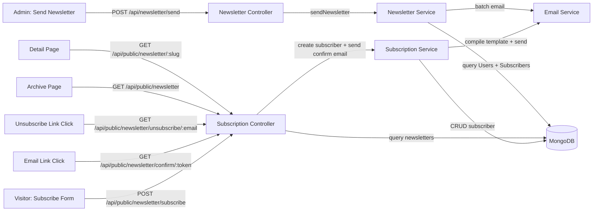

# Design Document: Newsletter Subscription

## Overview

The Newsletter Subscription feature extends Trustificate with a public-facing subscription workflow for non-registered visitors, a double opt-in confirmation flow, public newsletter archive pages for SEO, and updates to the existing broadcast system to include external subscribers. It spans:

- A new `Subscriber` Mongoose model in a new `backend/src/modules/subscriber/` module
- A `slug` field added to the existing `Newsletter` schema
- New public API endpoints under `/api/public/newsletter/` (subscribe, confirm, unsubscribe, archive list, archive detail)
- A new `newsletter-subscription-confirm.hbs` Handlebars email template
- Updates to the existing `newsletter.service.js` `sendNewsletter()` to query both `User` and `Subscriber` collections with email deduplication
- Frontend: `SubscribeForm` component, newsletter archive page, newsletter detail page, confirmation page, unsubscribed page
- New frontend routes at `/newsletter`, `/newsletter/:slug`, `/newsletter/confirm`, `/newsletter/unsubscribed`

The feature reuses `emailService.js` (Nodemailer + Handlebars), `apiResponse.js` helpers, `asyncHandler`, `AppError`, and the existing `newsletter-broadcast.hbs` template + `promotional-footer` partial. No new infrastructure or third-party dependencies are required.



## Architecture

### Backend

The feature introduces a new `subscriber` module and extends the existing `newsletter` module and `public` route.

#### New Module: `backend/src/modules/subscriber/`

Follows the standard module pattern with four files:
- `subscriber.schema.js` — Mongoose model for the `Subscriber` collection
- `subscriber.service.js` — Business logic for subscribe, confirm, unsubscribe, cleanup
- `subscriber.controller.js` — Request handlers for public subscription endpoints
- `subscriber.route.js` — Express router mounted under `/api/public/newsletter/`

#### Modifications to Existing Modules

1. **`newsletter.schema.js`** — Add `slug` field (String, unique, lowercase, trimmed) with a `pre('save')` hook that auto-generates the slug from `subject` + short UUID suffix.

2. **`newsletter.service.js`** — Update `sendNewsletter()` to:
   - Query both `User` (where `newsletterSubscribed: true`, `isActive: true`) and `Subscriber` (where `isConfirmed: true`)
   - Deduplicate by email, prioritizing User records
   - Construct appropriate unsubscribe links per recipient type (User ID-based vs Subscriber email-based)
   - Auto-generate slug when creating the Newsletter document

3. **`public.route.js`** — Mount the subscriber routes: `router.use('/newsletter', subscriberRoutes)`

#### Flow Details

1. **Subscribe flow**: `POST /api/public/newsletter/subscribe` → controller validates email → service checks for existing User/Subscriber → creates or updates Subscriber with token → sends confirmation email → responds 200.

2. **Confirm flow**: `GET /api/public/newsletter/confirm/:token` → controller calls service → service finds Subscriber by token, checks expiry → sets `isConfirmed: true`, clears token → redirects to frontend success page.

3. **Unsubscribe flow**: `GET /api/public/newsletter/unsubscribe/:email` → controller calls service → service checks Subscriber collection (deletes if found) and User collection (sets `newsletterSubscribed: false` if found) → redirects to frontend unsubscribed page.

4. **Archive list flow**: `GET /api/public/newsletter` → controller calls service → returns all newsletters sorted by `sentAt` desc, excluding `sentBy`.

5. **Archive detail flow**: `GET /api/public/newsletter/:slug` → controller calls service → returns single newsletter by slug, excluding `sentBy`. Returns 404 if not found.

6. **Updated broadcast flow**: `POST /api/newsletter/send` → existing controller → updated `sendNewsletter()` queries both collections, deduplicates, dispatches with per-recipient unsubscribe links, persists Newsletter with slug.

### Frontend

New pages and components:

| File | Route | Description |
|---|---|---|
| `components/SubscribeForm.tsx` | — | Reusable email input + submit form |
| `components/NewsletterCTA.tsx` | — | Conditional CTA: subscribe form or welcome message based on auth state |
| `pages/NewsletterArchive.tsx` | `/newsletter` | Public archive list page |
| `pages/NewsletterDetail.tsx` | `/newsletter/:slug` | Public single newsletter page |
| `pages/NewsletterConfirm.tsx` | `/newsletter/confirm` | Confirmation result page |
| `pages/NewsletterUnsubscribed.tsx` | `/newsletter/unsubscribed` | Static unsubscribed page |

All public routes use `OptionalProtectedRoute` wrapper and `PublicLayout`.

#### Modifications to Existing Frontend Files

1. **`hooks/useAuth.tsx`** — Add `newsletterSubscribed?: boolean` to the `AuthUser` interface so the conditional CTA can check subscription status.

2. **`components/PublicLayout.tsx`** — Add `{ label: "Newsletter", href: "/newsletter" }` to the `navLinks` array (between "Blog" and "About").

3. **`App.tsx`** — Add new routes for `/newsletter`, `/newsletter/:slug`, `/newsletter/confirm`, `/newsletter/unsubscribed` under the public routes section.

4. **`pages/Index.tsx`** — Add `NewsletterCTA` component in a dedicated section before the footer.

### Route Registration

- **Backend**: Subscriber routes are mounted via `public.route.js` at `/api/public/newsletter/`. No changes to `app.js` needed since `publicRoutes` is already mounted at `/api/public`.
- **Frontend**: New routes added to `App.tsx` under the public routes section.

## Components and Interfaces

### Backend

#### subscriber.route.js

```
POST   /api/public/newsletter/subscribe        → controller.subscribe
GET    /api/public/newsletter/confirm/:token    → controller.confirm
GET    /api/public/newsletter/unsubscribe/:email → controller.unsubscribe
GET    /api/public/newsletter                   → controller.list
GET    /api/public/newsletter/:slug             → controller.detail
```

No auth middleware on any of these routes.

#### subscriber.controller.js

| Handler       | Input                          | Output                                         |
|---------------|--------------------------------|-------------------------------------------------|
| `subscribe`   | `{ email: string }`            | 200 `{ success, message }` or 400 validation    |
| `confirm`     | `:token` param                 | 302 redirect to frontend or 400 error            |
| `unsubscribe` | `:email` param                 | 302 redirect to frontend or 200 generic message  |
| `list`        | —                              | 200 `{ success, data: Newsletter[] }`            |
| `detail`      | `:slug` param                  | 200 `{ success, data: Newsletter }` or 404       |

All handlers use `asyncHandler` and `success()`/`error()` response helpers.

#### subscriber.service.js

| Method | Responsibility |
|---|---|
| `subscribe(email)` | Checks User + Subscriber collections, creates/updates Subscriber with token, sends confirmation email |
| `confirmSubscription(token)` | Validates token + expiry, sets `isConfirmed: true`, clears token fields |
| `unsubscribe(email)` | Deletes Subscriber if found, sets User `newsletterSubscribed: false` if found |
| `cleanup()` | Deletes all unconfirmed Subscribers with expired `confirmationExpiry` |
| `getPublicNewsletters()` | Returns all newsletters sorted by `sentAt` desc, selecting only public fields |
| `getPublicNewsletterBySlug(slug)` | Returns single newsletter by slug with public fields only, or null |

#### newsletter.schema.js (modification)

Add to the existing schema:

```javascript
slug: { type: String, unique: true, lowercase: true, trim: true }
```

Add a `pre('save')` hook:

```javascript
newsletterSchema.pre('save', function (next) {
  if (this.isNew && !this.slug) {
    const base = this.subject
      .toLowerCase()
      .replace(/[^a-z0-9\s-]/g, '')
      .replace(/\s+/g, '-')
      .replace(/-+/g, '-')
      .replace(/^-|-$/g, '');
    const suffix = require('crypto').randomUUID().slice(0, 6);
    this.slug = `${base}-${suffix}`;
  }
  next();
});
```

#### newsletter.service.js (modification)

Updated `sendNewsletter()`:

```javascript
const sendNewsletter = async (subject, body, adminId) => {
  // 1. Query both collections
  const [users, subscribers] = await Promise.all([
    User.find({ newsletterSubscribed: true, isActive: true }).select('_id email'),
    Subscriber.find({ isConfirmed: true }).select('email'),
  ]);

  // 2. Deduplicate by email, User takes priority
  const userEmails = new Set(users.map(u => u.email.toLowerCase()));
  const uniqueSubscribers = subscribers.filter(s => !userEmails.has(s.email.toLowerCase()));

  // 3. Build recipient list with per-type unsubscribe links
  const allRecipients = [
    ...users.map(u => ({
      email: u.email,
      unsubscribeLink: `${FRONTEND_URL}/unsubscribe/${u._id}`,
    })),
    ...uniqueSubscribers.map(s => ({
      email: s.email,
      unsubscribeLink: `${FRONTEND_URL}/api/public/newsletter/unsubscribe/${encodeURIComponent(s.email)}`,
    })),
  ];

  // 4. Batch dispatch with Promise.allSettled
  // 5. Persist Newsletter with slug (auto-generated by pre-save hook)
};
```

#### newsletter-subscription-confirm.hbs (new template)

A new Handlebars template reusing `{{> email-header}}` and `{{> transactional-footer}}` partials. Accepts:
- `confirmationLink` — full URL to confirm subscription
- `email` — subscriber's email address

Includes a CTA button linking to `confirmationLink` and text noting the 24-hour expiry.

### Frontend

#### SubscribeForm.tsx (component)

Reusable component used on the landing page, archive page, and detail page.
- `react-hook-form` with zod schema: `{ email: z.string().email() }`
- Calls `POST /api/public/newsletter/subscribe` via `apiClient` without auth header
- Shows success message on 200, toast error on failure
- Loading state on submit button

#### NewsletterCTA.tsx (component)

Conditional CTA component used on the archive page, detail page, and landing page. Uses `useAuth()` hook to determine user state:

```typescript
// Logic:
// 1. user is null (anonymous) → render <SubscribeForm />
// 2. user is logged in AND user.newsletterSubscribed === false → render <SubscribeForm />
// 3. user is logged in AND user.newsletterSubscribed === true → render welcome message
```

This requires the `AuthUser` interface in `useAuth.tsx` to include `newsletterSubscribed?: boolean`, and the backend `GET /api/auth/me` response to include this field. The `getAuthUser` service already returns the full user object (minus `passwordHash`), so `newsletterSubscribed` is already present in the response — only the frontend `AuthUser` type needs updating.

#### PublicLayout.tsx (modification)

Add a "Newsletter" link to the `navLinks` array:

```typescript
const navLinks = [
  { label: "Product", href: "/#features" },
  { label: "Pricing", href: "/pricing" },
  { label: "Blog", href: "/blog" },
  { label: "Newsletter", href: "/newsletter" },
  { label: "About", href: "/about" },
  { label: "Careers", href: "/careers" },
  { label: "Contact", href: "/contact" },
];
```

#### NewsletterArchive.tsx (page)

Route: `/newsletter`. Uses `PublicLayout`.
- Fetches from `GET /api/public/newsletter` via `useQuery({ queryKey: ["public-newsletters"] })`
- Renders list of newsletters: subject as link to `/newsletter/:slug`, truncated body preview, formatted date
- Includes `NewsletterCTA` component (conditional CTA based on auth state)
- Loading skeleton, error state with retry

#### NewsletterDetail.tsx (page)

Route: `/newsletter/:slug`. Uses `PublicLayout`.
- Fetches from `GET /api/public/newsletter/:slug` via `useQuery`
- Displays full subject as heading, complete body, formatted date
- Sets `document.title` to newsletter subject for SEO
- Link back to `/newsletter` archive
- Includes `NewsletterCTA` component (conditional CTA based on auth state)
- 404 handling for unknown slugs

#### NewsletterConfirm.tsx (page)

Route: `/newsletter/confirm`. Uses `PublicLayout`.
- Reads `token` from query params
- Calls `GET /api/public/newsletter/confirm/:token` on mount
- Shows success or error message based on response

#### NewsletterUnsubscribed.tsx (page)

Route: `/newsletter/unsubscribed`. Uses `PublicLayout`.
- Static page confirming unsubscription
- Link back to home page

#### API Functions

New file `frontend/src/lib/publicNewsletter.ts`:

```typescript
import { apiClient, type ApiResponse } from '@/lib/apiClient';

export interface PublicNewsletter {
  _id: string;
  subject: string;
  body: string;
  slug: string;
  sentAt: string;
  recipientCount: number;
}

export function subscribeToNewsletter(email: string): Promise<ApiResponse<null>> {
  return apiClient<null>('/api/public/newsletter/subscribe', {
    method: 'POST',
    body: JSON.stringify({ email }),
  });
}

export function fetchPublicNewsletters(): Promise<ApiResponse<PublicNewsletter[]>> {
  return apiClient<PublicNewsletter[]>('/api/public/newsletter');
}

export function fetchPublicNewsletterBySlug(slug: string): Promise<ApiResponse<PublicNewsletter>> {
  return apiClient<PublicNewsletter>(`/api/public/newsletter/${slug}`);
}
```

## Data Models

### Subscriber Schema (new)

```javascript
const subscriberSchema = new mongoose.Schema(
  {
    email: {
      type: String,
      required: true,
      unique: true,
      lowercase: true,
      trim: true,
      match: [/\S+@\S+\.\S+/, 'Invalid email format'],
    },
    confirmationToken:  { type: String, default: null },
    confirmationExpiry: { type: Date, default: null },
    isConfirmed:        { type: Boolean, default: false },
    confirmedAt:        { type: Date, default: null },
  },
  { timestamps: true }
);
```

Collection name: `subscribers`

The `unique: true` on `email` creates the index automatically — no separate `.index()` call needed (per lesson #5).

### Newsletter Schema (modification)

Add one field to the existing `newsletterSchema`:

```javascript
slug: { type: String, unique: true, lowercase: true, trim: true }
```

Plus a `pre('save')` hook to auto-generate slug from subject + 6-char UUID suffix on creation.

### TypeScript Types (frontend)

```typescript
interface PublicNewsletter {
  _id: string;
  subject: string;
  body: string;
  slug: string;
  sentAt: string;
  recipientCount: number;
}

interface Subscriber {
  _id: string;
  email: string;
  isConfirmed: boolean;
  confirmedAt: string | null;
  createdAt: string;
}
```


## Correctness Properties

*A property is a characteristic or behavior that should hold true across all valid executions of a system — essentially, a formal statement about what the system should do. Properties serve as the bridge between human-readable specifications and machine-verifiable correctness guarantees.*

### Property 1: Subscriber schema defaults

*For any* new Subscriber document created with only an `email` field, `isConfirmed` shall be `false`, `confirmationToken` and `confirmationExpiry` shall be `null`, `confirmedAt` shall be `null`, and `createdAt`/`updatedAt` timestamps shall be present.

**Validates: Requirements 1.1, 1.3, 1.4**

### Property 2: Slug generation format

*For any* Newsletter subject string, the auto-generated slug shall be entirely lowercase, contain only alphanumeric characters and hyphens, have no consecutive hyphens, not start or end with a hyphen, and include a 6-character suffix. Two newsletters with the same subject shall produce different slugs.

**Validates: Requirements 1b.1, 1b.2, 1b.3**

### Property 3: Subscribe creates unconfirmed subscriber with token and expiry

*For any* valid email address submitted to the subscribe endpoint, the resulting Subscriber document shall have `isConfirmed` set to `false`, a non-null `confirmationToken`, and a `confirmationExpiry` approximately 24 hours in the future.

**Validates: Requirements 2.2**

### Property 4: Invalid email rejection

*For any* string that is not a valid email format (including empty strings, whitespace-only strings, strings without `@`, strings without a domain), the subscribe endpoint shall respond with HTTP 400.

**Validates: Requirements 2.7**

### Property 5: Consistent 200 response for all valid subscribe submissions

*For any* valid email address submitted to the subscribe endpoint — whether the email is new, belongs to an existing unconfirmed subscriber, an existing confirmed subscriber, or a registered user — the response shall always be HTTP 200 with a generic success message.

**Validates: Requirements 2.8**

### Property 6: Confirmation sets isConfirmed and clears token

*For any* Subscriber with a valid, non-expired `confirmationToken`, calling the confirm endpoint with that token shall result in `isConfirmed` being `true`, `confirmedAt` being set to a non-null timestamp, and both `confirmationToken` and `confirmationExpiry` being cleared to `null`.

**Validates: Requirements 3.2**

### Property 7: Unsubscribe removes subscriber or updates user

*For any* email address, calling the unsubscribe endpoint shall: delete the matching Subscriber document if one exists, and set `newsletterSubscribed` to `false` on the matching User document if one exists. The endpoint shall always respond with HTTP 200 regardless of whether a match was found.

**Validates: Requirements 4.2, 4.3, 4.5**

### Property 8: Broadcast recipient deduplication

*For any* set of User documents (with `newsletterSubscribed: true`, `isActive: true`) and Subscriber documents (with `isConfirmed: true`), the combined recipient list produced by `sendNewsletter` shall contain no duplicate email addresses. When a User and Subscriber share the same email, only the User record shall be included. The persisted `recipientCount` shall equal the size of this deduplicated list.

**Validates: Requirements 5.1, 5.2, 5.5**

### Property 9: Broadcast unsubscribe link type per recipient

*For any* recipient in the broadcast list, if the recipient originates from the User collection then the unsubscribe link shall contain the user's ID, and if the recipient originates from the Subscriber collection then the unsubscribe link shall contain the subscriber's email address.

**Validates: Requirements 5.3, 5.4**

### Property 10: Confirmation email template contains CTA with link

*For any* `confirmationLink` URL string, compiling the `newsletter-subscription-confirm` template with that link shall produce HTML containing an anchor (`<a>`) element whose `href` attribute equals the provided `confirmationLink`.

**Validates: Requirements 6.4**

### Property 11: Cleanup deletes only expired unconfirmed subscribers

*For any* set of Subscriber documents with varying `isConfirmed` and `confirmationExpiry` values, the cleanup function shall delete only those where `isConfirmed` is `false` AND `confirmationExpiry` is before the current time. Confirmed subscribers and unconfirmed subscribers with future expiry shall remain untouched.

**Validates: Requirements 7.1**

### Property 12: Public archive sorted descending by sentAt

*For any* set of Newsletter documents with distinct `sentAt` timestamps, the public archive endpoint shall return them in strictly descending order of `sentAt`.

**Validates: Requirements 10.2**

### Property 13: Public archive excludes admin info

*For any* Newsletter document returned by the public archive endpoints (`GET /api/public/newsletter` and `GET /api/public/newsletter/:slug`), the response shall not contain the `sentBy` field or any admin-identifying information.

**Validates: Requirements 10.3**

### Property 14: Slug lookup round-trip

*For any* Newsletter document with an auto-generated slug, querying the public detail endpoint with that slug shall return a document whose `subject`, `body`, and `sentAt` match the original.

**Validates: Requirements 10.5**

### Property 15: Archive page renders newsletter info with links

*For any* newsletter data object with `subject`, `body`, `slug`, and `sentAt`, the archive page shall render the subject as a clickable link to `/newsletter/:slug`, a truncated body preview, and a formatted date string.

**Validates: Requirements 11.3, 11.4**

### Property 16: Detail page renders full content and sets document title

*For any* newsletter data object with `subject`, `body`, and `sentAt`, the detail page shall render the full subject as a heading, the complete body text, a formatted date, and set `document.title` to include the newsletter subject.

**Validates: Requirements 12.3, 12.4, 12.8**

## Error Handling

| Scenario | Layer | Behavior |
|---|---|---|
| Invalid email on subscribe | `subscriber.controller.js` | Validates email format; responds HTTP 400 with validation error |
| Duplicate email on subscribe | `subscriber.service.js` | Detects existing Subscriber/User; returns 200 with generic message (no enumeration) |
| Invalid confirmation token | `subscriber.service.js` | No matching Subscriber found; controller responds HTTP 400 "Invalid link" |
| Expired confirmation token | `subscriber.service.js` | Token found but `confirmationExpiry` passed; controller responds HTTP 400 "Link expired" |
| Already confirmed subscriber confirms again | `subscriber.service.js` | Detects `isConfirmed: true`; responds HTTP 200 "Already confirmed" |
| Unsubscribe with unknown email | `subscriber.controller.js` | No Subscriber or User found; responds HTTP 200 generic message (no enumeration) |
| Email send failure on confirmation | `subscriber.service.js` | Logged via Winston; subscribe endpoint still returns 200 (fire-and-forget email) |
| Newsletter slug not found | `subscriber.controller.js` | No Newsletter matches slug; responds HTTP 404 "Newsletter not found" |
| MongoDB write failure on Subscriber create | `subscriber.service.js` | Caught by `asyncHandler`; global error handler responds 500 |
| Broadcast: individual email failure | `newsletter.service.js` | `Promise.allSettled` captures rejection; other sends continue; logged via Winston |
| Broadcast: no recipients found | `newsletter.service.js` | Proceeds normally; persists Newsletter with `recipientCount: 0` |
| Frontend subscribe API error | `SubscribeForm.tsx` | Toast error message; email input preserved |
| Frontend confirm API error | `NewsletterConfirm.tsx` | Displays error message (invalid or expired link) |
| Frontend archive fetch error | `NewsletterArchive.tsx` | Error message with retry button |
| Frontend detail fetch 404 | `NewsletterDetail.tsx` | "Newsletter not found" message with link to archive |

## Testing Strategy

### Unit Tests

Unit tests cover specific examples, edge cases, and integration points:

- **Subscriber schema**: valid document creation, rejection of missing email, unique constraint violation, default field values
- **Newsletter slug**: auto-generation on save, uniqueness across same subjects, format validation
- **Subscribe endpoint**: returns 200 for new email, returns 200 for already-confirmed email (edge case), returns 200 for registered user email (edge case), regenerates token for unconfirmed re-subscribe (edge case), returns 400 for invalid email
- **Confirm endpoint**: returns success for valid token, returns 400 for invalid token (edge case), returns 400 for expired token (edge case), returns 200 for already-confirmed (edge case), redirects to frontend page
- **Unsubscribe endpoint**: deletes Subscriber, updates User, returns 200 for unknown email, redirects to frontend page
- **Broadcast integration**: queries both collections, deduplicates correctly, constructs correct unsubscribe link types
- **Cleanup function**: deletes expired unconfirmed, preserves confirmed, preserves non-expired unconfirmed, logs count
- **Confirmation email template**: compiles with correct variables, contains CTA button, contains 24h expiry text, uses correct partials
- **Public archive endpoint**: returns newsletters without sentBy, sorted by sentAt desc, returns 404 for unknown slug
- **Frontend SubscribeForm**: renders email input + button, shows validation error for empty email, shows success message, shows loading state, shows error toast
- **Frontend NewsletterConfirm**: calls API on mount with token param, shows success/error messages
- **Frontend NewsletterArchive**: renders newsletter list, shows loading skeleton, shows error with retry, includes SubscribeForm
- **Frontend NewsletterDetail**: renders full content, sets document title, shows 404 message, includes SubscribeForm, includes back link

### Property-Based Tests

Property-based tests verify universal properties across randomized inputs. The project uses Vitest as the test runner.

- **Library**: `fast-check` (JavaScript/TypeScript property-based testing library)
- Each property test runs a minimum of 100 iterations
- Each test is tagged with a comment referencing the design property
- Tag format: **Feature: newsletter-subscription, Property {number}: {property_text}**
- Each correctness property MUST be implemented by a SINGLE property-based test

Properties to implement as PBT:

| Property | Test Description |
|---|---|
| P1 | Generate random valid email strings; create Subscriber with only email; assert defaults (isConfirmed=false, tokens=null, timestamps present) |
| P2 | Generate random subject strings (including special chars, unicode, spaces); run slug generation; assert lowercase, valid chars, no consecutive hyphens, suffix present; generate two slugs from same subject and assert they differ |
| P3 | Generate random valid emails; call subscribe service; assert created doc has isConfirmed=false, non-null token, expiry ~24h from now |
| P4 | Generate random invalid email strings (no @, no domain, whitespace, empty); call subscribe endpoint; assert 400 response |
| P5 | Generate random valid emails across all scenarios (new, existing confirmed, existing unconfirmed, registered user); call subscribe; assert all return 200 |
| P6 | Generate random subscribers with valid tokens; call confirm; assert isConfirmed=true, confirmedAt set, token/expiry cleared |
| P7 | Generate random emails with varying Subscriber/User existence; call unsubscribe; assert Subscriber deleted if existed, User.newsletterSubscribed=false if existed, always 200 |
| P8 | Generate random sets of Users and Subscribers with overlapping emails; run deduplication logic; assert no duplicate emails, User priority, recipientCount matches |
| P9 | Generate random mixed recipient lists (User + Subscriber); build unsubscribe links; assert User links contain ID, Subscriber links contain email |
| P10 | Generate random confirmationLink URLs; compile template; assert output HTML contains anchor with matching href |
| P11 | Generate random sets of Subscribers with varying isConfirmed/expiry; run cleanup; assert only expired+unconfirmed are deleted |
| P12 | Generate random Newsletter docs with distinct sentAt dates; call public archive; assert descending order |
| P13 | Generate random Newsletter docs; call public archive endpoints; assert no sentBy field in any response object |
| P14 | Generate random Newsletter docs with slugs; query by slug; assert returned doc matches original subject/body/sentAt |
| P15 | Generate random newsletter data arrays; render archive component; assert each item has link to /newsletter/:slug, truncated body, formatted date |
| P16 | Generate random newsletter data; render detail component; assert subject heading, full body, formatted date, document.title contains subject |

Properties P5, P7 are best tested with integration-level PBT (mocked DB). Properties P15, P16 are component-level PBT (render with random data). All others are unit-level PBT.
