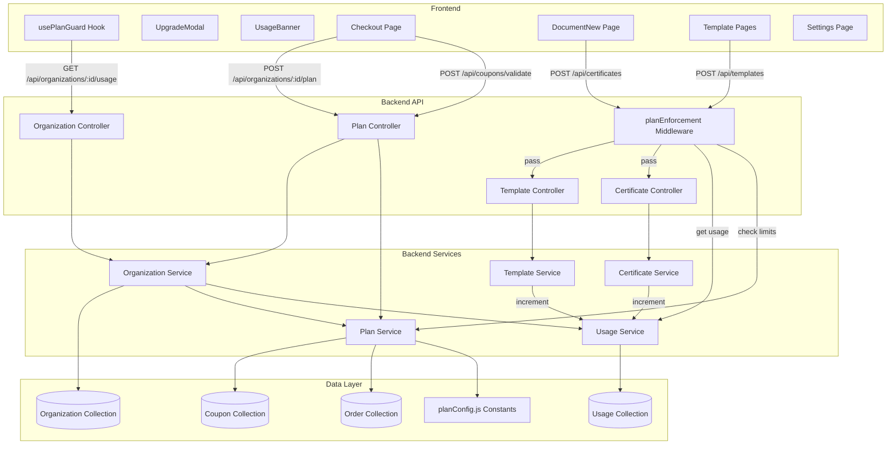
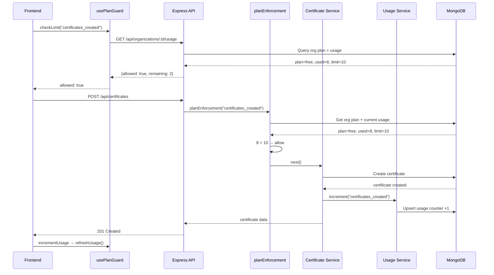
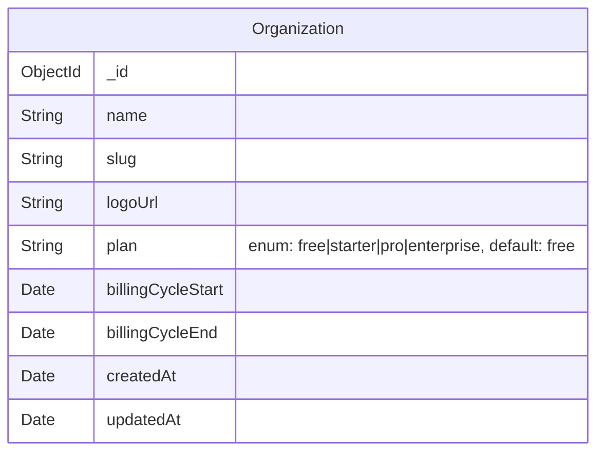
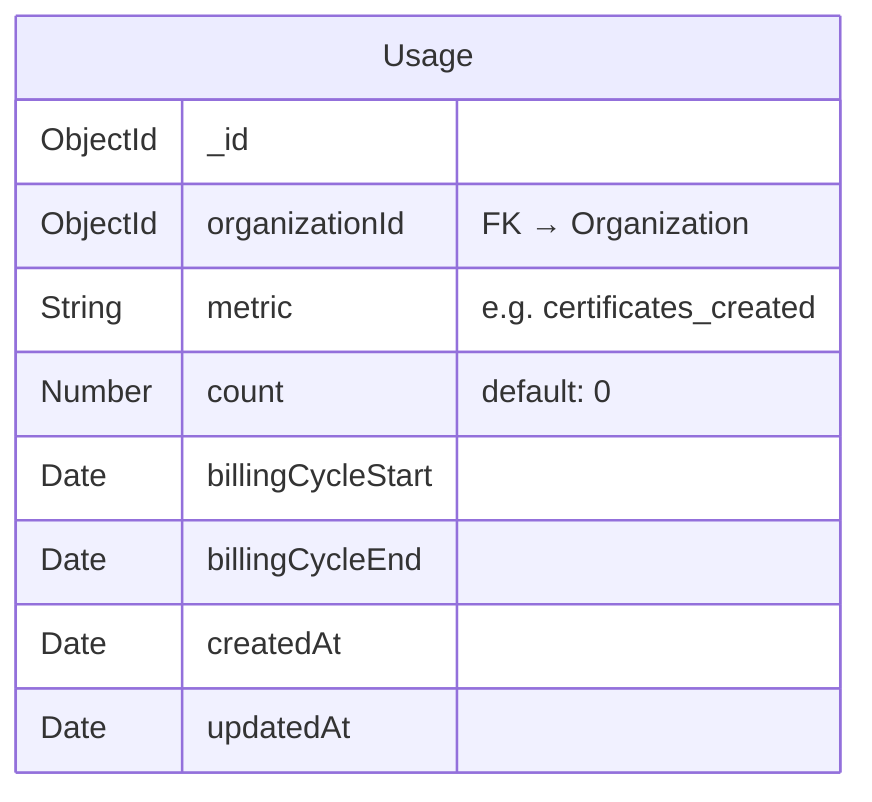
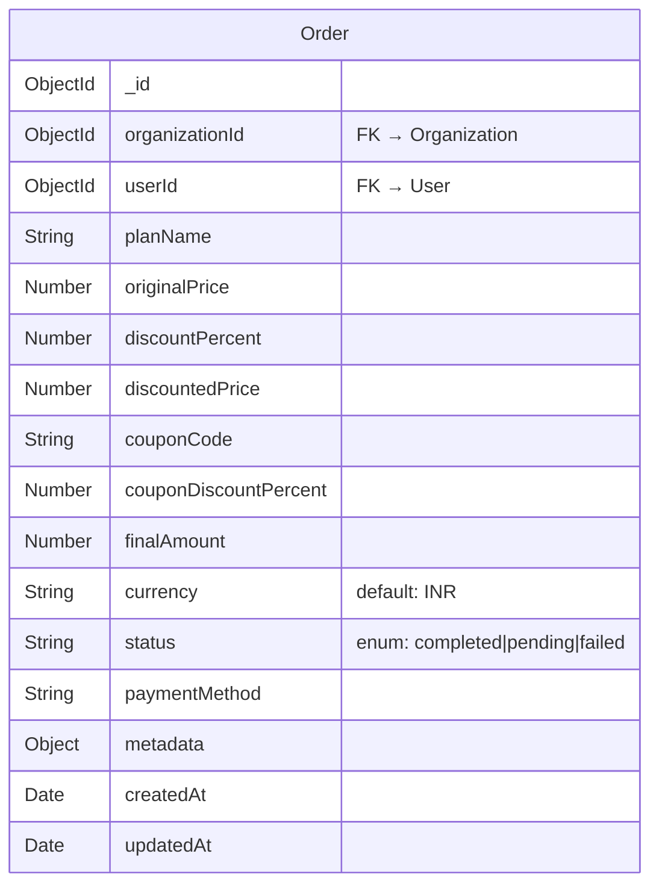
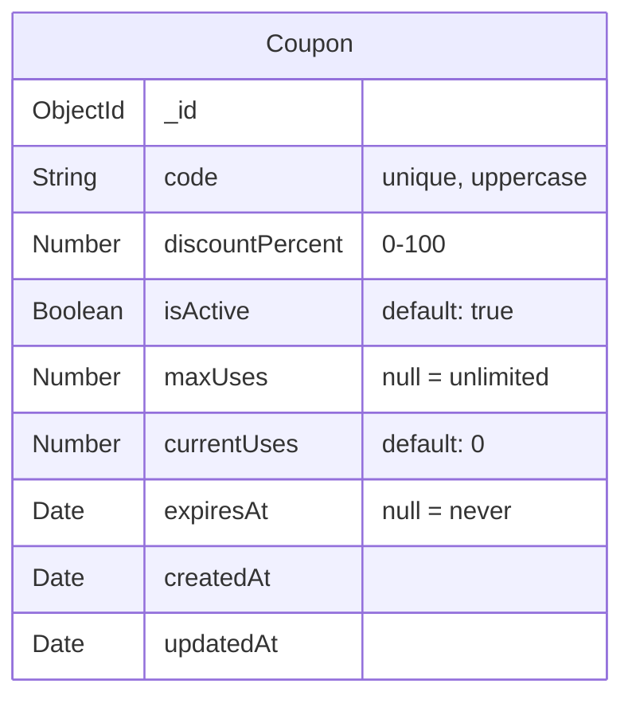
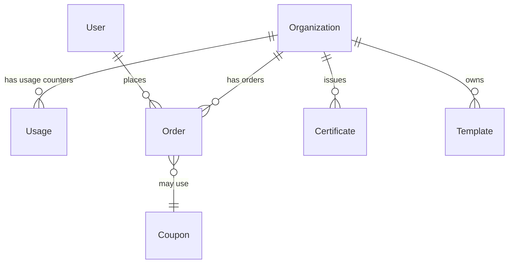

# Design Document: SaaS Pricing Plans

## Overview

This design implements a complete SaaS pricing and plan enforcement system for Trustificate. The current codebase has placeholder stubs — `getUsage()` returns hardcoded 999999 limits, `incrementUsage()` is a no-op, `checkLimit()` always returns `allowed: true`, and the Checkout page calls Supabase directly. This design replaces all of that with real plan definitions, persistent MongoDB-backed usage tracking, server-side enforcement middleware, a functional client-side plan guard, and a backend-driven checkout flow.

The system follows a layered enforcement model: the backend is the source of truth (server-side middleware rejects over-limit requests), while the frontend provides optimistic UX feedback (plan guard checks before API calls, usage banners warn at 80%/100%).

### Key Design Decisions

1. **Plan definitions as constants, not a DB collection** — Plans change infrequently and are identical across all orgs. Storing them in `backend/src/utils/planConfig.js` avoids unnecessary DB queries and keeps the system simple. If dynamic plan management is needed later, this can be migrated to a collection.

2. **Separate Usage collection instead of embedding in Organization** — Usage counters are high-write (every certificate/template creation), while Organization is low-write. A separate `Usage` collection avoids write contention and makes billing cycle resets trivial (just query by date range).

3. **Enforcement as a reusable middleware** — Rather than scattering limit checks across individual service functions, a `planEnforcement.middleware.js` intercepts requests before they reach controllers. This keeps services focused on business logic and makes enforcement impossible to bypass.

4. **Coupon validation on the backend** — Moving coupon logic from Supabase RPC to Express endpoints eliminates the Supabase dependency for plan management and keeps all business logic in one place.

## Architecture



### Request Flow: Certificate Creation



## Components and Interfaces

### Backend Components

#### 1. `backend/src/utils/planConfig.js` — Plan Definitions

Central source of truth for all plan tiers, limits, feature flags, and pricing.

```js
// Exported shape
module.exports = {
  PLANS: {
    free: { name: 'Free', limits: { certificates_created: 10, templates_created: 1 }, features: {...}, price: 0 },
    starter: { name: 'Starter', limits: { certificates_created: 500, templates_created: 10 }, features: {...}, price: 999 },
    pro: { name: 'Pro', limits: { certificates_created: -1, templates_created: -1 }, features: {...}, price: 3499 },
    enterprise: { name: 'Enterprise', limits: { certificates_created: -1, templates_created: -1 }, features: {...}, price: -1 },
  },
  getPlan: (planId) => PLANS[planId] || PLANS.free,
  isUnlimited: (limit) => limit === -1,
};
```

#### 2. `backend/src/modules/usage/usage.schema.js` — Usage Collection

Mongoose model for per-org, per-metric, per-billing-cycle usage counters.

```js
// Schema fields
{
  organizationId: ObjectId (ref: Organization, required, indexed),
  metric: String (required, e.g. "certificates_created"),
  count: Number (default: 0),
  billingCycleStart: Date (required),
  billingCycleEnd: Date (required),
}
// Compound index: { organizationId, metric, billingCycleStart }
```

#### 3. `backend/src/modules/usage/usage.service.js` — Usage Service

Handles reading and incrementing usage counters with billing cycle awareness.

```js
// Key functions
getUsageForOrg(orgId, billingCycleStart, billingCycleEnd)
  → Returns { certificates_created: N, templates_created: N }

incrementUsage(orgId, metric, billingCycleStart, billingCycleEnd, amount = 1)
  → Upserts usage doc, $inc count by amount

getUsageForMetric(orgId, metric, billingCycleStart, billingCycleEnd)
  → Returns count for a single metric
```

#### 4. `backend/src/middlewares/planEnforcement.middleware.js` — Enforcement Middleware

Express middleware factory that checks plan limits before allowing resource creation.

```js
// Usage in routes:
router.post('/', protect, enforcePlanLimit('certificates_created'), controller.create);

// enforcePlanLimit(metric) returns middleware that:
// 1. Gets org from req.user.organizationId
// 2. Gets plan config for org.plan
// 3. If limit is -1, call next()
// 4. Gets current usage for metric in current billing cycle
// 5. If usage >= limit, throw AppError(403, 'Plan limit reached')
// 6. For bulk: checks req.body.rows.length + usage <= limit
// 7. Otherwise, call next()
```

#### 5. `backend/src/modules/order/order.schema.js` — Order Collection

Records completed plan purchases/upgrades.

```js
{
  organizationId: ObjectId (required),
  userId: ObjectId (required),
  planName: String (required),
  originalPrice: Number,
  discountPercent: Number,
  discountedPrice: Number,
  couponCode: String,
  couponDiscountPercent: Number,
  finalAmount: Number,
  currency: String (default: 'INR'),
  status: String (enum: ['completed', 'pending', 'failed']),
  paymentMethod: String,
  metadata: Object,
}
```

#### 6. `backend/src/modules/coupon/coupon.schema.js` — Coupon Collection

Stores valid coupon codes and their discount percentages.

```js
{
  code: String (required, unique, uppercase),
  discountPercent: Number (required, 0-100),
  isActive: Boolean (default: true),
  maxUses: Number (default: null — unlimited),
  currentUses: Number (default: 0),
  expiresAt: Date (default: null),
}
```

#### 7. `backend/src/modules/plan/plan.controller.js` + `plan.route.js` — Plan Endpoints

New routes for plan management:

- `POST /api/coupons/validate` — Validates a coupon code, returns `{ valid, discount_percent, code }` or `{ valid: false, error }`
- `POST /api/organizations/:id/plan` — Updates org plan. Accepts `{ plan, couponCode }`. Validates coupon, creates order record, updates org plan + billing cycle.

#### 8. Updated `organization.schema.js`

Extended with plan and billing fields:

```js
{
  // existing fields...
  plan: { type: String, enum: ['free', 'starter', 'pro', 'enterprise'], default: 'free' },
  billingCycleStart: { type: Date, default: Date.now },
  billingCycleEnd: { type: Date, default: () => new Date(Date.now() + 30 * 24 * 60 * 60 * 1000) },
}
```

#### 9. Updated `organization.service.js`

`getUsage()` replaced with real implementation that:
1. Reads org's `plan` field
2. Looks up plan config from `planConfig.js`
3. Queries `Usage` collection for current billing cycle
4. Returns real limits, usage, and billing dates

`incrementUsage()` replaced to delegate to `usage.service.js`.

`createOrganization()` updated to set `plan: 'free'` and billing cycle dates.

#### 10. Updated Certificate & Template Services

After successful creation (non-draft for certificates), call `usageService.incrementUsage()` to record the usage.

### Frontend Components

#### 1. Updated `usePlanGuard.ts`

`checkLimit()` replaced with real logic:
1. Fetches fresh usage from API
2. Compares `usage[metric]` against `limits[metric]`
3. If limit is -1, returns `allowed: true` (unlimited)
4. Returns `{ allowed, usage, limit, remaining, plan_name }`

#### 2. Updated `Checkout.tsx`

Migrated from Supabase to backend API:
- Coupon validation: `POST /api/coupons/validate` via `apiClient`
- Order completion: `POST /api/organizations/:id/plan` via `apiClient`
- Removes all `supabase` imports

#### 3. Updated `Settings.tsx`

New "Plan & Billing" card showing:
- Current plan name and billing cycle end date
- Usage progress bars for certificates and templates
- "Upgrade Plan" button → navigates to `/checkout?plan=<next>`
- Promotional banner for Free plan users mentioning FREE_100 coupon

#### 4. Updated `UsageBanner.tsx`

Already functional — displays at 80% (warning) and 100% (urgent). Needs to handle `-1` (unlimited) by not rendering.

#### 5. Updated `siteData.ts`

Update Free tier features to match requirements: "Up to 10 credentials/month" (was 50), "1 template" (already correct).

## Data Models

### Organization (updated)



### Usage (new)



### Order (new)



### Coupon (new)



### Entity Relationships




## Correctness Properties

*A property is a characteristic or behavior that should hold true across all valid executions of a system — essentially, a formal statement about what the system should do. Properties serve as the bridge between human-readable specifications and machine-verifiable correctness guarantees.*

### Property 1: New organization defaults

*For any* organization creation input (name, slug), the resulting organization document should have `plan` equal to `"free"`, `billingCycleStart` set to approximately the current time, and `billingCycleEnd` set to exactly 30 days after `billingCycleStart`.

**Validates: Requirements 2.4**

### Property 2: Usage increment upsert

*For any* organizationId, metric string, and billing cycle date range, calling `incrementUsage` N times should result in a single Usage document with `count` equal to N. Calling it again with a different amount M should result in `count` equal to N + M.

**Validates: Requirements 3.2**

### Property 3: Billing cycle isolation

*For any* organization with usage records across multiple billing cycles, querying usage for a specific billing cycle should return only the counters belonging to that cycle. Usage from expired or future cycles must not be included. If no records exist for the queried cycle, all counters should be zero.

**Validates: Requirements 3.3, 3.4, 6.4**

### Property 4: Enforcement rejects over-limit requests

*For any* organization on a plan with a finite limit (limit > 0) for a given metric, if the current usage for that metric is greater than or equal to the limit, then a creation request for that resource type should be rejected with HTTP 403. This applies to both `certificates_created` and `templates_created` metrics.

**Validates: Requirements 4.2, 5.2**

### Property 5: Resource creation increments usage

*For any* successful non-draft certificate creation or any successful template creation, the corresponding usage counter (`certificates_created` or `templates_created`) should increase by exactly 1 compared to its value before the creation.

**Validates: Requirements 4.3, 5.3**

### Property 6: Bulk enforcement checks total

*For any* bulk certificate creation request with R valid rows, if the organization's current `certificates_created` usage plus R exceeds the plan's certificate limit, the entire request should be rejected with HTTP 403 before any rows are processed.

**Validates: Requirements 4.4**

### Property 7: Unlimited plans bypass enforcement

*For any* organization on a plan where the limit for a given metric is -1 (unlimited), creation requests for that resource type should always be allowed regardless of the current usage count.

**Validates: Requirements 4.5, 5.4**

### Property 8: Usage API response consistency

*For any* organization, the GET `/api/organizations/:id/usage` response should return: a `plan_name` matching the organization's `plan` field, `limits` matching the plan's definition in `planConfig.js`, `usage` counters matching the sum of Usage documents for the current billing cycle, `billing_cycle_start` and `billing_cycle_end` matching the organization's fields, and `price_monthly` matching the plan's configured price.

**Validates: Requirements 6.1, 6.2, 6.3**

### Property 9: Plan guard limit check correctness

*For any* numeric usage value and numeric limit value (where limit > 0), `checkLimit` should return `allowed: false` when usage >= limit, and `allowed: true` with `remaining` equal to `limit - usage` when usage < limit. When limit is -1, `checkLimit` should always return `allowed: true`.

**Validates: Requirements 7.2, 7.3, 7.4**

### Property 10: Usage banner threshold rendering

*For any* usage and limit pair where limit > 0: if usage/limit < 0.8, the UsageBanner should render nothing; if 0.8 <= usage/limit < 1.0, it should render a warning variant; if usage/limit >= 1.0, it should render a destructive/urgent variant. When limit is -1 or limit is 0, the banner should render nothing.

**Validates: Requirements 9.1, 9.2, 9.6**

### Property 11: Coupon validation correctness

*For any* coupon code, the POST `/api/coupons/validate` endpoint should return `{ valid: true, discount_percent, code }` if a matching active, non-expired, non-exhausted coupon exists in the database, and `{ valid: false, error }` otherwise. The `discount_percent` must match the coupon's stored value.

**Validates: Requirements 13.4, 10.2**

### Property 12: Plan upgrade creates order and updates organization

*For any* valid plan upgrade request (valid plan name, valid or no coupon), the POST `/api/organizations/:id/plan` endpoint should: create an Order document with the correct pricing breakdown, update the organization's `plan` field to the new plan, and reset `billingCycleStart` to the current date and `billingCycleEnd` to 30 days later.

**Validates: Requirements 13.3, 10.5**

## Error Handling

### Backend Error Handling

All errors follow the existing `AppError` pattern and are caught by `asyncHandler`.

| Scenario | Status | Message | Code |
|---|---|---|---|
| Certificate creation over plan limit | 403 | `Plan limit reached: you have used {usage}/{limit} certificates this billing cycle. Upgrade your plan to continue.` | `PLAN_LIMIT_REACHED` |
| Template creation over plan limit | 403 | `Plan limit reached: you have used {usage}/{limit} templates. Upgrade your plan to continue.` | `PLAN_LIMIT_REACHED` |
| Bulk upload exceeds remaining quota | 403 | `Bulk upload would exceed plan limit: {rows} certificates requested but only {remaining} remaining.` | `PLAN_LIMIT_EXCEEDED` |
| Invalid coupon code | 400 | `Coupon not found or inactive` | `INVALID_COUPON` |
| Expired coupon | 400 | `Coupon has expired` | `COUPON_EXPIRED` |
| Exhausted coupon (maxUses reached) | 400 | `Coupon usage limit reached` | `COUPON_EXHAUSTED` |
| Invalid plan name in upgrade | 400 | `Invalid plan: {plan}` | `INVALID_PLAN` |
| Organization not found during enforcement | 404 | `Organization not found` | — |
| Unauthorized plan upgrade (not org admin) | 403 | `Not authorized` | — |

### Frontend Error Handling

- `usePlanGuard.checkLimit()` returns `{ allowed: false, reason }` on failure — the UI shows the UpgradeModal rather than a generic error toast
- API errors from enforcement middleware (403 with `PLAN_LIMIT_REACHED`) are caught by `apiClient` and surfaced via `toast.error()` as a fallback if the frontend guard was bypassed
- Checkout coupon validation errors are displayed inline below the coupon input field
- Network failures during usage fetch default to `orgUsage = null`, which causes the dashboard to hide the usage card gracefully rather than crash

### Billing Cycle Edge Cases

- If `billingCycleEnd` is in the past when a request arrives, the usage service treats usage as 0 for the new implicit cycle. The org's billing dates are not auto-updated — they update on the next plan change or can be handled by a future cron job.
- Race condition on concurrent certificate creation: MongoDB's `$inc` is atomic, so two simultaneous increments won't lose counts. However, two requests could both pass the limit check before either increments. This is acceptable for now — the overshoot is at most the number of concurrent requests, which is negligible for this scale.

## Testing Strategy

### Testing Framework

- **Backend**: Jest (or the project's existing test runner) with `mongodb-memory-server` for integration tests
- **Frontend**: Vitest + @testing-library/react (already configured)
- **Property-based testing**: `fast-check` library for both backend (Node.js) and frontend (Vitest)

### Unit Tests

Unit tests cover specific examples, edge cases, and integration points:

- **Plan config**: Verify all four plans exist with correct limits, features, and prices (Requirements 1.1–1.4)
- **Organization schema defaults**: Create an org and verify `plan: "free"`, billing dates set (Requirement 2.1–2.3)
- **Usage service edge cases**: Empty usage returns 0, expired billing cycle returns 0 (Requirements 3.4, 6.4)
- **Enforcement middleware**: Specific scenarios — free plan at 10/10 certs rejected, pro plan at 5000 certs allowed (Requirements 4.2, 4.5)
- **Coupon validation**: FREE_100 returns 100% discount, unknown code returns invalid (Requirements 10.2, 10.3)
- **Plan upgrade**: Upgrade from free to starter creates order, updates org (Requirement 10.5)
- **Frontend plan guard**: Mock API returning usage at limit → `allowed: false` (Requirement 7.2)
- **UsageBanner**: Render at 79% → nothing, 80% → warning, 100% → destructive (Requirements 9.1, 9.2)
- **UpgradeModal**: Opens with correct plan info when triggered (Requirements 9.3, 9.5)
- **Settings page**: Renders plan name, usage bars, upgrade button (Requirements 12.1–12.4)
- **Checkout page**: Renders plan summary, applies coupon, shows confirmation (Requirements 10.1, 10.3, 10.6)
- **Pricing data**: siteData.ts has correct Free tier limits (Requirement 11.1–11.5)

### Property-Based Tests

Each property test uses `fast-check` with a minimum of 100 iterations. Each test is tagged with a comment referencing its design property.

| Property | Test Description | Generator Strategy |
|---|---|---|
| Property 1 | Generate random org names/slugs, verify defaults | `fc.record({ name: fc.string(), slug: fc.string() })` |
| Property 2 | Generate random orgIds, metrics, increment counts | `fc.nat()` for counts, `fc.string()` for metrics |
| Property 3 | Generate usage records across multiple billing cycles, query one | `fc.date()` for cycle boundaries |
| Property 4 | Generate random plans with finite limits, set usage >= limit, attempt creation | `fc.constantFrom('free','starter')` for plans, `fc.nat()` for usage |
| Property 5 | Create resources, verify counter delta is exactly 1 | `fc.constantFrom('certificates_created','templates_created')` |
| Property 6 | Generate random row counts and current usage, verify bulk rejection when sum > limit | `fc.nat()` for rows and usage |
| Property 7 | Generate random usage counts for unlimited plans, verify always allowed | `fc.nat()` for usage |
| Property 8 | Generate orgs with random plans, create known usage, verify API response matches | `fc.constantFrom('free','starter','pro','enterprise')` |
| Property 9 | Generate random usage/limit pairs, verify checkLimit result | `fc.nat()` for usage, `fc.oneof(fc.nat(), fc.constant(-1))` for limit |
| Property 10 | Generate random usage/limit pairs, verify banner variant | `fc.nat()` for usage and limit |
| Property 11 | Generate random coupon codes (some matching DB, some not), verify response | `fc.string()` for codes |
| Property 12 | Generate random plan upgrades with/without coupons, verify order + org update | `fc.constantFrom('starter','pro','enterprise')` for plans |

### Test Configuration

- Each property-based test must run a minimum of **100 iterations**
- Each test must include a tag comment: `// Feature: saas-pricing-plans, Property {N}: {title}`
- Property tests validate universal invariants; unit tests validate specific examples and edge cases
- Both are required for comprehensive coverage
