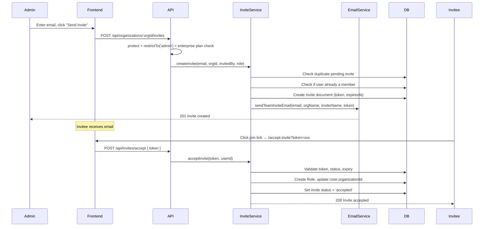
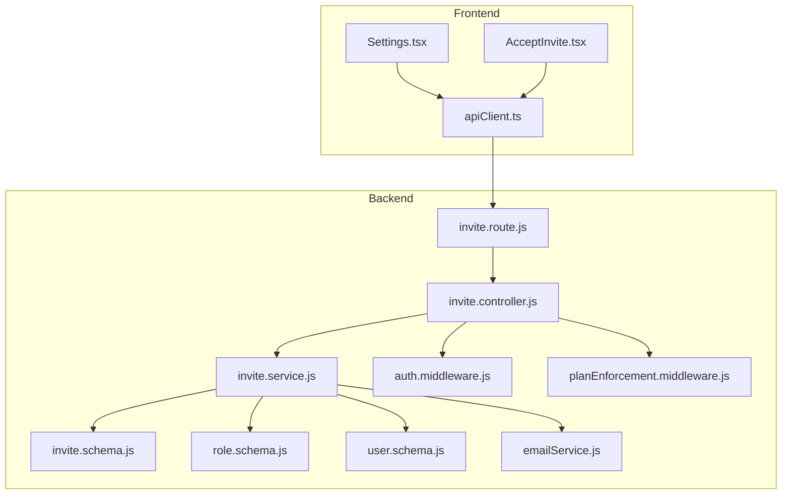

# Design Document: Team Invite Workflow

## Overview

This design adds a complete team invite workflow to Trustificate, gated behind the Enterprise plan. It introduces an Invite module (schema, service, controller, routes) following the existing backend module pattern, extends the Organization schema with additional profile fields, adds a `team-invite` Handlebars email template, and updates the frontend Settings page to support invite management and team member display.

The key flows are:
1. An Enterprise admin invites a user by email → Invite record created → email sent with a tokenized join link.
2. The invitee clicks the link → if logged in, the invite is accepted and they join the org; if not registered, they're redirected to signup with the token preserved.
3. Admins can list and revoke pending invites from the Settings page.
4. All usage (certificates, templates, team members) is tracked at the organization level.



## Architecture

The feature follows the existing modular architecture:

### Backend

- **New module**: `backend/src/modules/invite/` with `invite.schema.js`, `invite.service.js`, `invite.controller.js`, `invite.route.js`
- **Modified module**: `backend/src/modules/organization/organization.schema.js` — add optional fields (website, industry, description, contactEmail)
- **Modified module**: `backend/src/modules/organization/organization.service.js` — slug update validation
- **Modified config**: `backend/src/utils/planConfig.js` — add `team_members` limit to all plans
- **New email template**: `backend/src/templates/emails/team-invite.hbs`
- **Modified service**: `backend/src/services/emailService.js` — add `sendTeamInviteEmail()`
- **Modified entry**: `backend/src/app.js` — register invite routes

### Frontend

- **New page**: `frontend/src/pages/AcceptInvite.tsx` — handles the `/accept-invite?token=xxx` route
- **Modified page**: `frontend/src/pages/Settings.tsx` — enhanced Team Members card with invite form, pending invites list, member list, and enterprise gating
- **Modified page**: `frontend/src/pages/Signup.tsx` — preserve invite token through registration flow
- **Modified router**: `frontend/src/App.tsx` — add `/accept-invite` route

### Middleware Reuse

- `protect` — JWT auth on all invite endpoints
- `restrictTo('admin')` — admin-only for send/list/revoke
- `enforcePlanLimit('team_members')` — plan limit check on invite creation
- Enterprise plan check — custom middleware or inline check in controller



## Components and Interfaces

### Backend API Endpoints

#### Invite Routes (`/api/organizations/:orgId/invites`)

| Method | Path | Auth | Description |
|--------|------|------|-------------|
| POST | `/api/organizations/:orgId/invites` | protect, restrictTo('admin') | Send invite |
| GET | `/api/organizations/:orgId/invites` | protect, restrictTo('admin') | List invites |
| PATCH | `/api/organizations/:orgId/invites/:inviteId/revoke` | protect, restrictTo('admin') | Revoke invite |

#### Public Invite Routes (`/api/invites`)

| Method | Path | Auth | Description |
|--------|------|------|-------------|
| GET | `/api/invites/:token` | none | Get invite details (for accept-invite page) |
| POST | `/api/invites/accept` | protect | Accept invite |

### Invite Service Interface

```javascript
// invite.service.js
module.exports = {
  createInvite(email, organizationId, invitedBy, role),  // → Invite doc
  acceptInvite(token, userId),                            // → { invite, role }
  getInviteByToken(token),                                // → Invite doc (populated)
  listInvitesForOrg(organizationId),                      // → Invite[]
  revokeInvite(inviteId, organizationId),                 // → Invite doc
};
```

### Invite Controller Interface

```javascript
// invite.controller.js
module.exports = {
  sendInvite,      // POST /api/organizations/:orgId/invites
  listInvites,     // GET /api/organizations/:orgId/invites
  revokeInvite,    // PATCH /api/organizations/:orgId/invites/:inviteId/revoke
  getInviteInfo,   // GET /api/invites/:token
  acceptInvite,    // POST /api/invites/accept
};
```

### Organization Service Changes

```javascript
// Added to organization.service.js
updateOrganization(orgId, userId, data)  // Enhanced: validate slug uniqueness on change
getTeamMembers(orgId)                    // New: returns populated Role[] with user details
```

### Email Service Addition

```javascript
// Added to emailService.js
sendTeamInviteEmail(email, orgName, inviterName, joinLink)
```

### Frontend Components

#### AcceptInvite Page
- Reads `token` from URL query params
- If user is authenticated: calls `POST /api/invites/accept` with the token
- If user is not authenticated: redirects to `/signup?invite=<token>`
- Shows loading, success, and error states

#### Settings Page — Team Section (Enhanced)
- Enterprise gating: shows upgrade prompt for non-enterprise plans
- Invite form: email input + role selector + send button
- Pending invites table: email, status, sent date, revoke button
- Team members table: name, email, role, joined date


## Data Models

### Invite Schema (New)

```javascript
// backend/src/modules/invite/invite.schema.js
const mongoose = require('mongoose');

const inviteSchema = new mongoose.Schema(
  {
    email: {
      type: String,
      required: true,
      lowercase: true,
      trim: true,
      match: [/\S+@\S+\.\S+/, 'Invalid email format'],
    },
    organizationId: {
      type: mongoose.Schema.Types.ObjectId,
      ref: 'Organization',
      required: true,
    },
    invitedBy: {
      type: mongoose.Schema.Types.ObjectId,
      ref: 'User',
      required: true,
    },
    role: {
      type: String,
      enum: ['admin', 'user'],
      default: 'user',
    },
    token: {
      type: String,
      unique: true,
      required: true,
    },
    status: {
      type: String,
      enum: ['pending', 'accepted', 'expired', 'revoked'],
      default: 'pending',
    },
    expiresAt: {
      type: Date,
      required: true,
    },
  },
  { timestamps: true }
);

// Prevent duplicate pending invites for the same email + org
inviteSchema.index(
  { email: 1, organizationId: 1 },
  {
    unique: true,
    partialFilterExpression: { status: 'pending' },
  }
);

module.exports = mongoose.model('Invite', inviteSchema);
```

### Organization Schema (Modified)

New optional fields added to the existing schema:

```javascript
// Added fields to backend/src/modules/organization/organization.schema.js
{
  website: {
    type: String,
    default: null,
    validate: {
      validator: (v) => !v || /^https?:\/\/.+/.test(v),
      message: 'Website must be a valid URL starting with http:// or https://',
    },
  },
  industry: { type: String, default: null, trim: true },
  description: {
    type: String,
    default: null,
    maxlength: [500, 'Description must be under 500 characters'],
  },
  contactEmail: {
    type: String,
    default: null,
    lowercase: true,
    trim: true,
    validate: {
      validator: (v) => !v || /\S+@\S+\.\S+/.test(v),
      message: 'Invalid contact email format',
    },
  },
}
```

### Plan Config (Modified)

Add `team_members` limit to all plans:

```javascript
// backend/src/utils/planConfig.js — limits additions
free:       { team_members: 1 },
starter:    { team_members: 3 },
pro:        { team_members: 10 },
enterprise: { team_members: -1 },  // unlimited
```

### Existing Schemas (Unchanged)

- **User Schema**: Already has `organizationId` field — used to link accepted invitees to their org.
- **Role Schema**: Already has `userId`, `organizationId`, `role` with a unique compound index — used to create membership on invite acceptance.


## Correctness Properties

*A property is a characteristic or behavior that should hold true across all valid executions of a system — essentially, a formal statement about what the system should do. Properties serve as the bridge between human-readable specifications and machine-verifiable correctness guarantees.*

### Property 1: Organization additional fields round-trip

*For any* Organization and any combination of valid optional field values (website as a valid URL or null, industry as a string or null, description as a string ≤500 chars or null, contactEmail as a valid email or null), updating the Organization with those values and then fetching it should return the same values.

**Validates: Requirements 1.1, 1.2**

### Property 2: Invalid organization field values are rejected

*For any* string that is not a valid URL (does not match `^https?://.+`), setting it as the Organization's website should produce a validation error. Similarly, *for any* string that is not a valid email (does not match `\S+@\S+\.\S+`), setting it as the Organization's contactEmail should produce a validation error.

**Validates: Requirements 1.4, 1.5**

### Property 3: Slug validation rules

*For any* string, the slug validation should accept it if and only if it is lowercase, contains only alphanumeric characters and hyphens, is between 3 and 60 characters, and does not start or end with a hyphen. All other strings should be rejected.

**Validates: Requirements 2.2**

### Property 4: Invite creation invariants

*For any* valid invite creation (valid email, enterprise org, admin user, within team_members limit), the resulting Invite document should have: a `token` that is a hex string of at least 64 characters (32 bytes), an `expiresAt` within a small tolerance of exactly 7 days from creation, and a `status` of `'pending'`.

**Validates: Requirements 3.2, 3.3, 4.1**

### Property 5: Invite email contains required information

*For any* invite, the generated email should contain the inviter's display name, the organization name, a call-to-action link matching the format `{FRONTEND_URL}/accept-invite?token={invite_token}`, and the subject line should be `"You've been invited to join {organization_name} on Trustificate"`.

**Validates: Requirements 10.2, 10.3, 10.4**

### Property 6: Enterprise plan gating

*For any* Organization whose plan is not `'enterprise'`, all invite-related endpoints (send, list, revoke) should return a 403 error with the message "Team invites are available on the Enterprise plan only".

**Validates: Requirements 4.5, 6.4**

### Property 7: Team members limit enforcement

*For any* Organization that has reached its `team_members` plan limit, attempting to send a new invite should be rejected with a 403 plan-limit error.

**Validates: Requirements 4.6, 8.4**

### Property 8: Invite acceptance round-trip

*For any* valid pending non-expired Invite and any registered user who does not belong to another organization, accepting the invite should: create a Role record linking the user to the organization with the invite's role, update the user's `organizationId` to the invite's organization, and set the invite's status to `'accepted'`.

**Validates: Requirements 5.1, 5.4**

### Property 9: Revoke then accept fails

*For any* pending Invite, revoking it should set its status to `'revoked'`, and any subsequent attempt to accept that invite's token should fail with an appropriate error.

**Validates: Requirements 6.2**

### Property 10: Invite list sorted descending by creation date

*For any* Organization with one or more invites, the list endpoint should return invites sorted by `createdAt` in descending order (newest first).

**Validates: Requirements 6.1**

### Property 11: Non-admin access denied for invite management

*For any* user with the `'user'` role (not `'admin'`), attempting to list, send, or revoke invites should return a 403 error.

**Validates: Requirements 6.3**

### Property 12: Organization-level usage accounting

*For any* member of an Organization, creating a certificate or template should increment the Organization's usage counter for the respective metric, not an individual user counter.

**Validates: Requirements 8.1, 8.2**

### Property 13: Team member join increments counter

*For any* accepted invite, the Organization's `team_members` usage metric should be incremented by 1.

**Validates: Requirements 8.3**

### Property 14: Members list returns populated user data

*For any* Organization with members, the members list endpoint should return each member's `displayName`, `email`, `role`, and `createdAt` fields, all non-null.

**Validates: Requirements 9.3**

## Error Handling

### Backend Error Strategy

All errors use the existing `AppError` class thrown from service methods and caught by `asyncHandler`. The global error handler in `app.js` formats them into the standard `{ success: false, message }` response.

| Scenario | Status | Message |
|----------|--------|---------|
| Invalid invite token / not found | 404 | "Invite not found" |
| Invite expired | 410 | "This invite has expired" |
| Duplicate pending invite | 409 | "An invite is already pending for this email" |
| User already a member | 409 | "This user is already a member of the organization" |
| User belongs to another org | 409 | "User already belongs to another organization" |
| Non-enterprise plan | 403 | "Team invites are available on the Enterprise plan only" |
| Plan limit reached | 403 | "Plan limit reached: you have used X/Y team members..." |
| Non-admin access | 403 | "You do not have permission for this action." |
| Invalid slug format | 422 | Joi validation error details |
| Duplicate slug | 409 | "Organization slug already in use" |
| Invalid website URL | 400 | "Website must be a valid URL starting with http:// or https://" |
| Invalid contact email | 400 | "Invalid contact email format" |

### Frontend Error Handling

- API errors caught via `apiClient` which throws `ApiError` with status and message
- Toast notifications via `sonner` for user-facing errors
- AcceptInvite page shows specific error states: expired, already used, invalid token
- Settings page invite form shows inline validation and API error toasts

### Edge Cases

- **Expired invite auto-detection**: When a user tries to accept an expired invite, the service updates the status to `'expired'` before returning the 410 error.
- **Race condition on duplicate invites**: The partial unique index on `{ email, organizationId }` where `status: 'pending'` handles concurrent duplicate invite attempts at the database level.
- **User already in org**: Checked before creating the Role to prevent duplicate memberships.
- **Token collision**: Crypto.randomBytes(32) has negligible collision probability; the unique index on `token` provides a safety net.

## Testing Strategy

### Property-Based Testing

Use **fast-check** as the property-based testing library for the frontend (Vitest environment) and backend unit tests.

Each property test must:
- Run a minimum of 100 iterations
- Reference its design document property with a tag comment
- Use `fc.assert(fc.property(...))` pattern

Tag format: `Feature: team-invite-workflow, Property {number}: {property_text}`

### Unit Tests

Unit tests complement property tests by covering:
- Specific edge cases: expired tokens, duplicate invites, already-a-member scenarios
- Integration points: email service called with correct args, middleware chain order
- Error conditions: invalid tokens, non-admin access, non-enterprise plan access
- Database constraints: unique index violations, required field validation

### Test Organization

```
backend/src/modules/invite/__tests__/
  invite.service.test.js     — Service logic (property + unit tests)
  invite.controller.test.js  — Controller/route integration tests

frontend/src/test/
  accept-invite.test.tsx     — AcceptInvite page tests
  settings-team.test.tsx     — Team section of Settings page tests
```

### Key Test Scenarios

**Property tests** (fast-check, 100+ iterations each):
- Properties 1–14 as defined in the Correctness Properties section above

**Unit tests** (specific examples):
- Expired invite acceptance → 410 error
- Revoked invite acceptance → error
- Duplicate pending invite → 409 error
- Already-a-member invite → 409 error
- User in another org accepting → 409 error
- Non-enterprise plan invite attempt → 403 error
- Enterprise planConfig includes `team_members` field (Requirement 8.5)
- `team-invite.hbs` template file exists (Requirement 10.1)
- Slug with special characters rejected
- Slug shorter than 3 or longer than 60 characters rejected
- Description longer than 500 characters rejected

